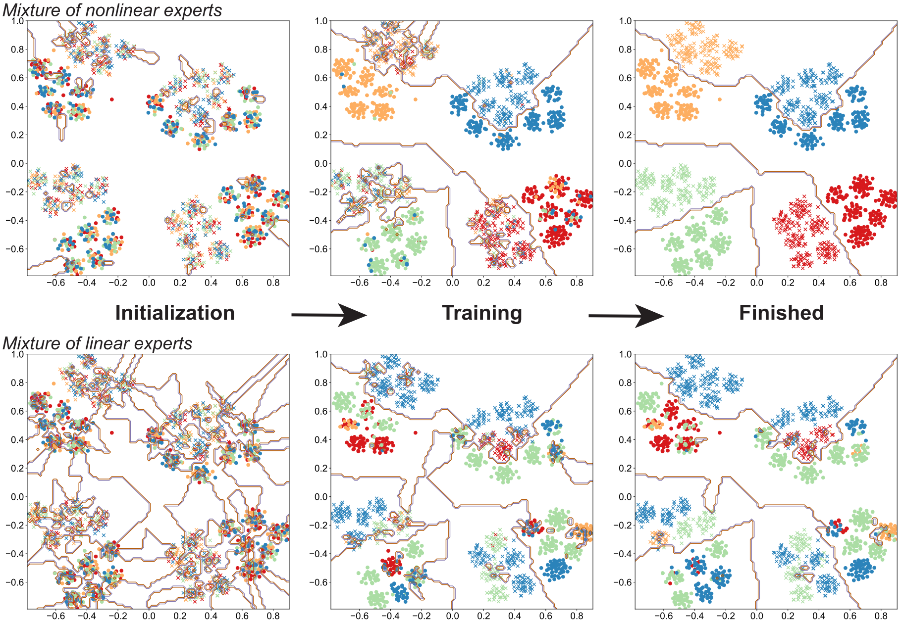

# MoE
This is the official repository for paper "[Towards Understanding the Mixture-of-Experts Layer in Deep Learning](https://par.nsf.gov/servlets/purl/10379033)" in NeurIPS 2022.

## Overview
Under our data distribution, the underlying cluster structure cannot be recovered
by the mixture of **linear** experts but can be successfully learned by mixture of **nonlinear** experts.

## Install requirements
```
pip install -r requirements.txt
```

## Usage
- **Synthetic Data Directories (synthetic_data_s1/2/3/4)**: These directories contain the synthetic data for each setting (1/2/3/4) used in our synthetic experiments. The data for setting 1 is generated by the 'synthetic_data_s1.ipynb' notebook, and similar for setting 2/3/4.

- **Synthetic Experiment Notebooks (synthetic_demo_s1.ipynb)**: These notebooks are used for performing synthetic experiments in each setting (1/2/3/4). The experiments test the performance of single linear CNNs, single nonlinear CNNs, and mixtures of both linear and nonlinear experts.

- **Data Visualization Notebook (MoE_Visualization.ipynb)**: This notebook contains the visualization code that we use to visualize the data. In addition, it also displays the routing and decision boundary learned by the Mixture-of-Experts (MoE) model.

- **Routing Entropy Tracking Notebook (Entropy_change_s1.ipynb)**: This notebook is designed for synthetic experiments that track the changes in routing entropy under setting 1. Similar notebooks are available for settings 2.